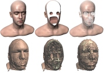
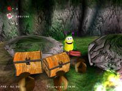
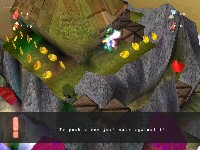

# Projects

2025
======
- Software developer at [weltenbauer. Software Entwicklung GmbH](https://www.weltenbauer-se.com/de)
    - Undisclosed projects
- Unreal Engine 5.5 pet project for educational purposes [COUnreal](https://github.com/cofenberg/COUnreal) (private repository, invitation on request)
  - x64 Windows pre-build binary Google Drive link: [COUnreal_Windows_05012025.zip](https://drive.google.com/file/d/10VgECE7o8D5OggUtF7A36ypup3ggsZRK/view?usp=sharing)
  
  

2024
======
- Starting July: Software developer at [weltenbauer. Software Entwicklung GmbH](https://www.weltenbauer-se.com/de)
    - Undisclosed projects
- Unreal Engine 5.4 pet project for educational purposes [COUnreal](https://github.com/cofenberg/COUnreal) (private repository, invitation on request)
  - x64 Windows pre-build binary Google Drive link: [COUnreal_Windows_24062024.zip](https://drive.google.com/file/d/13QuyYYHppetUQluZAR6B4v5t_lzC7u6V/view?usp=sharing)
  
- January - June: Senior software developer at [Promotion Software GmbH](https://promotion-software.de/website/) / [Sixteen Tons Entertainment](http://www.sixteen-tons.de/)

2023
======
- Senior software developer at [Promotion Software GmbH](https://promotion-software.de/website/) / [Sixteen Tons Entertainment](http://www.sixteen-tons.de/)
  - Free-to-play [EMERGENCY](https://store.steampowered.com/app/850170/EMERGENCY/) using Unreal Engine 5 released 15. August 2023

2019-2022
======
- Senior software developer at [Promotion Software GmbH](https://promotion-software.de/website/) / [Sixteen Tons Entertainment](http://www.sixteen-tons.de/)
  - Unannounced game project using Unreal Engine 4
- Pet project [Unrimp](https://github.com/cofenberg/unrimp)

2018
======
- Senior software developer at [Promotion Software GmbH](https://promotion-software.de/website/) / [Sixteen Tons Entertainment](http://www.sixteen-tons.de/)
  - Unannounced game project using Unreal Engine 4
  - Lead software developer of the [TEAMWORK research project](https://www.teamworkprojekt.de/) 3D simulator and editor
  - Undisclosed client research projects
- Pet project [Unrimp](https://github.com/cofenberg/unrimp)

2017
======
- Senior software developer at [Promotion Software GmbH](https://promotion-software.de/website/) / [Sixteen Tons Entertainment](http://www.sixteen-tons.de/)
  - [EMERGENCY 20](https://store.steampowered.com/app/735280/EMERGENCY_20/) + [Mac version](https://apps.apple.com/de/app/emergency-20/id1323078187?mt=12)
  - Lead software developer of the [TEAMWORK research project](https://www.teamworkprojekt.de/tcc/) 3D simulator and editor
  - Undisclosed client research projects, one of them involving [HoloLens](https://www.microsoft.com/en-us/hololens) and [Leap Motion](https://www.leapmotion.com/) using [Unity](https://unity3d.com/)
- Pet project [Unrimp](https://github.com/cofenberg/unrimp)

2016
======
- Senior software developer at [Promotion Software GmbH](https://promotion-software.de/website/) / [Sixteen Tons Entertainment](http://www.sixteen-tons.de/)
  - [EMERGENCY 2017](https://store.steampowered.com/app/735280/EMERGENCY_20/) + [Mac version](https://apps.apple.com/de/app/emergency-2017/id1179452614?mt=12)
  - Lead software developer of the [TEAMWORK research project](https://www.teamworkprojekt.de/tcc/) 3D simulator and editor
  - Undisclosed client research projects
- Pet project [Unrimp](https://github.com/cofenberg/unrimp)

2015
======
- Senior software developer at [Promotion Software GmbH](https://promotion-software.de/website/) / [Sixteen Tons Entertainment](http://www.sixteen-tons.de/)
  - Upgraded [Quadriga Simulation Framework (QSF)](https://github.com/16tons/emergency5_sdk) and EMERGENCY 5 inside three months from Direct3D 9 to Direct3D 11
  - Ported together with [Christoffer Anselm](https://www.paindevs.com/) [EMERGENCY 5 to Mac](https://itunes.apple.com/us/app/emergency-5/id1008178056?mt=12)
  - [EMERGENCY 2016](https://store.steampowered.com/app/735280/EMERGENCY_20/)
  - Undisclosed client research projects, one of them involving [Oculus Rift](https://www.oculus.com/rift/) Development Kit 2
- Pet project [Unrimp](https://github.com/cofenberg/unrimp)

2012 - 2014
======
- Senior software developer at [Promotion Software GmbH](https://promotion-software.de/website/) / [Sixteen Tons Entertainment](http://www.sixteen-tons.de/)
    - [Quadriga Simulation Framework (QSF)](https://github.com/16tons/emergency5_sdk)
    - [EMERGENCY 5](https://store.steampowered.com/app/735280/EMERGENCY_20/) (see also [EMERGENCY 5 World Builder Tutorials](https://www.youtube.com/watch?v=w4MGTixQzUQ&list=PLcRyDsry13D5zElQlh1NPy4KaVXfq0tso&ab_channel=SixteenTonsEntertainment)), release November 2014
- Froze all spare time projects during this over two years long intensive development phase at my job to be able to get the necessary work  done in the available amount of time

2012
======
- [ 3D engine](https://github.com/cofenberg/pixellight)
  -   
  - [YouTube-Videos](https://www.youtube.com/user/pixellight3d):  
- [Master-Thesis "Scalable Realtime Volume Rendering" (in German)](Academic/MasterThesis/Ofenberg2012.pdf) - Implemented as plugins for the [PixelLight 3D engine](https://github.com/cofenberg/pixellight)
  -      
  - [YouTube-Videos](https://www.youtube.com/user/pixellight3d):  
- Contributed to the paper ["Indoor Navigation Using Particle Filter and Sensor Fusion"](http://www.annualofnavigation.pl/en.php?s=26,past%20issues&gr=No%2019/2012%20part%202&nr=215)
  - Bibtex: @article{Koeping12:INU, author = {Lukas Köping and Thomas Mühsam and Christian Ofenberg and Bernhard Czech and Michael Bernard and Jens Schmer and Frank Deinzer}, title = {{Indoor Navigation Using Particle Filter and Sensor Fusion}}, journal = {Annual of Navigation}, year = {2012}, month = {December}, volume = {19}, number = {2}, pages = {31-40}, } 
- Pet project [Unrimp](https://github.com/cofenberg/unrimp): The first public Unrimp source code release after starting the project on Friday, 1 June 2012 was on January 03, 2013.
-  September 2012: Started at [Promotion Software GmbH](https://promotion-software.de/website/) as lead in-house software technology developer with focus on engine, graphics, [tools](https://www.youtube.com/watch?v=w4MGTixQzUQ) and support for gameplay programing, artists and quality assurance. The division [Sixteen Tons Entertainment](http://www.sixteen-tons.de/) of this company is known for the [EMERGENCY](https://en.wikipedia.org/wiki/Emergency_(video_game_series)) PC game series. Now having [Ralph Stock](https://www.mobygames.com/developer/sheet/view/developerId,2528/) as chef, one of the of the most experienced veterans in the German computer games industry who released his first game 1984, two years after I was born. Started the [Quadriga Simulation Framework (QSF)](https://github.com/16tons/emergency5_sdk), the technical foundation of the PC game [EMERGENCY 5](https://store.steampowered.com/app/735280/EMERGENCY_20/).
 
2011
======
- [ 3D engine](https://github.com/cofenberg/pixellight)
  -    
  - [YouTube-Videos](https://www.youtube.com/user/pixellight3d):   

2010
======
- [ 3D engine](https://github.com/cofenberg/pixellight) - Since 16.9.2002 in development, first public release was on 23.08.2010
- [Bachelor-Thesis "Fast 2D/3D registration of medical images on the GPU"](Academic/BachelorThesis/Ofenberg2010.pdf) (using OpenCL, in German)

2006-2010
======
- [ 3D engine](https://github.com/cofenberg/pixellight)
- Worked on several [benntec Systemtechnik GmbH](https://www.benntec.de/) 3D projects

2005
======
- [ 3D engine](https://github.com/cofenberg/pixellight)
-  Article ["Die wunderbare Welt der Ebenen"](2000_2005/Article/PlaneMania.pdf), a German article I wrote for [Developia](https://www.developia.de/)

2004
======
- [ 3D engine](https://github.com/cofenberg/pixellight)
-  A HDR viewer for Microsoft Windows [Stefan Buschmann](https://www.game-coder.de/) and I developed for [Sachform](http://www.sachform.de/) using our [PixelLight 3D engine](https://github.com/cofenberg/pixellight)

2003
======
 The development of the [PixelLight 3D engine](https://github.com/cofenberg/pixellight) continued.

---
In 2003, I started to work in a team to develop commercial software. Therefore, after 2002 there are no more freeware games.

Nearly all projects below are freeware and published under the [GNU GENERAL PUBLIC LICENSE](2000_2005/gnu_general_public_license.txt). From the most projects the source code is also free available.
Some projects have an own sub page you can enter by clicking on the project name.

2002
======
-  Blibs
  - A game I worked on now and then during the past last years. I canceled this project due to lack of time. Platform: Windows - OpenGL.
  - Download: ["blibs.zip"](2000_2005/Blibs/blibs.zip) (includes source codes), old webside backup is available for download as well under ["blibs-page.zip"](2000_2005/Blibs/blibs-page.zip)
  -    
- [ Softgames.de - The Game (click for old HTML sub-page)](http://htmlpreview.github.io/?https://github.com/cofenberg/ablazespace/blob/master/Projects/2000_2005/STG/stg.html)
  - "Softgames.de - The Game" is, as the name indicates, a promotion game for [Softgames.de](https://www.softgames.de/). Platform: Windows - OpenGL.
  - Download: ["stg.zip"](2000_2005/STG/stg.zip) (source codes available via sub-page)
- [ The Second Evolution](2000_2005/TheSecondEvolution/se.jpg)
  - [The Second Evolution](http://www.second-evolution.de/) was a commercial game project of [Happy-Grafix](http://www.happy-grafix.de/) / [Bytestorm](http://www.bytestorm.org/). I worked on this game as a programmer for one year. The "Vulpine Vision"-engine was used which was later on known as "[Trinigy Vision](http://www.trinigy.de/)"-engine.
- [ Subscape (click for old HTML sub-page)](http://htmlpreview.github.io/?https://github.com/cofenberg/ablazespace/blob/master/Projects/2000_2005/Subscape/subscape.html)
  - I canceled this project due to lack of time. Platform: Windows - OpenGL.
  - Download: ["subscape.zip"](2000_2005/Subscape/subscape.zip) (includes source codes)
- [NeHe GameTutorial 7](2000_2005/NeHeGameTutorial7/NeHeGameTutorial7.zip): A small tutorial about free 3D movement I wrote together with Trent Polack (nickname "ShiningKnight") for [NeHe](http://nehe.gamedev.net/).
-  On 16 September, 2002 the development of the [PixelLight](https://github.com/cofenberg/pixellight) 3D engine started.

2001
======
- [ AblazeBall (click for old HTML sub-page)](http://htmlpreview.github.io/?https://github.com/cofenberg/ablazespace/blob/master/Projects/2000_2005/AblazeBall/ablazeball.html)
  - AblazeBall is a game with random generated levels. The goal if the game is to bring up two big fire balls into an ablaze space in the middle of each level. Platform: Windows - OpenGL.
  - Download: ["ablazeball.zip"](2000_2005/AblazeBall/ablazeball.zip) (source codes available via sub-page)
- [ Convey (click for old HTML sub-page)](http://htmlpreview.github.io/?https://github.com/cofenberg/ablazespace/blob/master/Projects/2000_2005/Convey/convey.html)
  - Convey is clone of a game I played as a kid, but packed with a lot of new elements. Especially fans of logical games will be zesty. Platform: Windows - OpenGL.
  - Download: ["conveydemo2.zip"](2000_2005/Convey/conveydemo2.zip) (source codes available via sub-page)
-  Blaze Chicken: Should be a clone of a game I played on the Amiga 500... never finished.
- List
  - A tiny program which writes all the names of the file which are in a directory into a txt-file. Can be used for instance to make a list of all your mp3's. Platform: Windows.
  - Download: ["list.zip"](2000_2005/List/list.zip) (includes source codes)

2000
======
- [ Invasion 2 (click for old HTML sub-page)](http://htmlpreview.github.io/?https://github.com/cofenberg/ablazespace/blob/master/Projects/2000_2005/Invasion2/invasion2.html)
  - Asteroids bounce against each other... and the players, too. Sometimes there are gravitation influences. With it you can make unusual manoeuvres. Platform: Windows - OpenGL
  - Download: ["invasion2.zip"](2000_2005/Invasion2/invasion2.zip) (source codes available via sub-page)
- [ Invasion (click for old HTML sub-page)](http://htmlpreview.github.io/?https://github.com/cofenberg/ablazespace/blob/master/Projects/2000_2005/Invasion/invasion.html)
  - You control a spaceship you could fire and you have to preserve your planet... an invasions of aliens coming through a wormhole is running. Platform: Windows - OpenGL. 
  - Download: ["invasion.zip"](2000_2005/Invasion/invasion.zip) (source codes available via sub-page)
- [ Alzey (click for old HTML sub-page)](http://htmlpreview.github.io/?https://github.com/cofenberg/ablazespace/blob/master/Projects/2000_2005/Alzey/alzey.html)
  - In each of the 21 levels you have to accomplish certain missions (collect all diamonds, kill all enemies...). Platform: Windows - OpenGL.
  - Download: ["alzey.zip"](2000_2005/Alzey/alzey.zip) (source codes available via sub-page)
- [ ASO-Creator (click for old HTML sub-page)](http://htmlpreview.github.io/?https://github.com/cofenberg/ablazespace/blob/master/Projects/2000_2005/ASO_Creator/aso-creator.html)
  - With this program you are able to create aso-model animations. It loads VRML files and uses them as key-frames. I created the animations of some games (Invasion, Invasion 2 and Convey) with it. Platform: Windows - OpenGL.
  - Download: ["aso-creator.zip"](2000_2005/ASO_Creator/aso-creator.zip) (source codes available via sub-page)
- Ratespiel
  - A simple "find my number"-game. In German. Platform: Windows.
  - Download: ["ratespiel.zip"](2000_2005/Ratespiel/ratespiel.zip) (includes source codes)
- Software rasterizer
  - A simple software rasterizer from line up to textured triangle
  - Download: ["Documents.zip"](2000_2005/SoftwareRasterizer/Documents.zip) (in German), ["Line.zip"](2000_2005/SoftwareRasterizer/Line.zip) (includes source codes), ["Polygon.zip"](2000_2005/SoftwareRasterizer/Polygon.zip) (includes source codes), ["3D_Demo.zip"](2000_2005/SoftwareRasterizer/3D_Demo.zip)

1999
======
-  Fools
  - Your mission in "Fools" is to navigate your little proteges through the levels towards the exit. You will deal with damaged floors, infected fields, black holes... A given number of your "Fools" have to survive every level. Platform: Windows - DirectX.
  - Download: ["fools.zip"](1995_1999/Fools/fools.zip)
  - Additional downloads ["fools_scr.zip"](1995_1999/Fools/fools_scr.zip), ["fools_levels.zip"](1995_1999/Fools/fools_levels.zip), ["fools_background.zip"](1995_1999/Fools/fools_background.zip)

---
Below you will find my old MD-DOS projects. I recommend to use [DosBox](https://www.dosbox.com/) to run these programs.

1998
======
- [ Crisis (click for old HTML sub-page)](http://htmlpreview.github.io/?https://github.com/cofenberg/ablazespace/blob/master/Projects/1995_1999/DOS/Crisis/crisis.html)
  - At the beginning of the game you will see a lot of stones on the table. Your task is now to remove as many stones as you can. Platform: MS-DOS.
  - Download: ["crisis.zip"](1995_1999/DOS/Crisis/crisis.zip) (source codes available via sub-page)
- [ Algorithmus (click for old HTML sub-page)](http://htmlpreview.github.io/?https://github.com/cofenberg/ablazespace/blob/master/Projects/1995_1999/DOS/Algorithmus/algorithmus.html)
  - When the game begins, a field flashes for a few seconds. You have to click on this field. After that two fields will flash. Click on both fields in the order they flashed. A third field flashes and so on. You have to remember the order. This goes on until you clicked on a wrong field (inadvertently or deliberately). Platform: MS-DOS.
  - Download: ["algorithmus.zip"](1995_1999/DOS/Algorithmus/algorithmus.zip) (source codes available via sub-page)
-  Equal
  - Equal is a card game with a simple computer AI. Not finished. Platform: MS-DOS.
  - Download: ["equal.zip"](1995_1999/DOS/Equal/equal.zip) (no source codes)
-  Tet
  - This was my first attempt to write a game which could really be described as a game... not finished, too. Platform: MS-DOS.
  - Download: ["tet.zip"](1995_1999/DOS/Tet/tet.zip) (no source codes)

1997
======
-  Equal
  - Equal is a card game with a simple computer AI. Not finished. Platform: MS-DOS.
  - Download: ["equal_old.zip"](1995_1999/DOS/Equal_old/equal_old.zip) (includes source codes)
-  Ball
  - Simple ball game. Platform: MS-DOS.
  - Download: ["ball.zip"](1995_1999/DOS/Ball/ball.zip) (includes source codes)
-  Pac
  - Totally unfinished clone of a classic arcade game. Platform: MS-DOS.
  - Download: ["pac.zip"](1995_1999/DOS/Pac/pac.zip) (no source codes)
-  Fire
  - A game were you have to shoot on down falling parachutes. Platform: MS-DOS
  - Download: ["fire.zip"](1995_1999/DOS/Fire/fire.zip) (includes source codes)
- [ High-Low (click for old HTML sub-page)](http://htmlpreview.github.io/?https://github.com/cofenberg/ablazespace/blob/master/Projects/1995_1999/DOS/HighLow/highlow.html)
  - A simple "find my number" game. Platform: MS-DOS
  - Download: ["highlow.zip"](1995_1999/DOS/HighLow/highlow.zip) (no source codes)

1996
======
-  Logic-Leap
  - At the beginning of the game you will see a lot of stones on the table. Your task is now to remove as many stones as you can. Platform: MS-DOS.
  - Download: ["logic.zip"](1995_1999/DOS/Logic/logic.zip) (includes source codes)
-  Trace
  - Totally unfinished clone of a classic arcade game. Platform: MS-DOS.
  - Download: ["trace.zip"](1995_1999/DOS/Trace/trace.zip) (no source codes)

1995
======
-  Text
  - This is my first game I wrote in C (it's virtually from my personal stone age). At that time I actually didn't know what I was doing. It's only a very simple text adventure which is not complete. Platform: MS-DOS
  - Download: ["text.zip"](1995_1999/DOS/Text/text.zip) (no source codes)

1994
======
- I was unable to recover stuff like my very first Amiga Basic games
